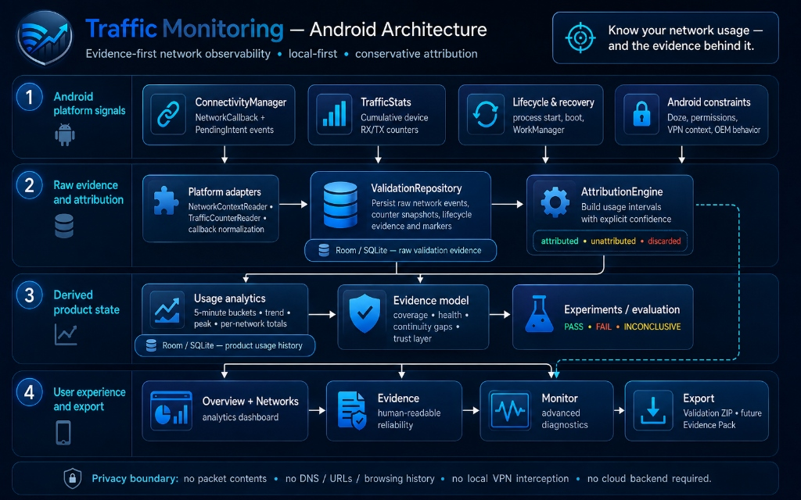

# Architecture

## Goal

Separate Android platform behavior from attribution logic and from the evidence/experiment product layer so the hardest parts of the system remain deterministic, testable and auditable.

The architecture must support two kinds of truth:

1. **measurement truth** — what Android actually delivered and what the counters actually reported;
2. **product interpretation** — usage, Evidence Coverage, experiments and assertions derived from that evidence.

Derived product state must never erase or rewrite the raw evidence that produced it.

## Dependency direction

```text
UI → Application → Domain ← Platform
                  ↓
             Persistence
                  ↓
               Export
```

The domain layer must not depend on Android SDK classes or observability-vendor SDKs.



```text
1. Android platform signals
   ConnectivityManager (NetworkCallback + PendingIntent) / TrafficStats / Lifecycle & recovery / Android constraints
                 ↓
2. Raw evidence and attribution
   Platform adapters → ValidationRepository (Room/SQLite) → AttributionEngine (attributed / unattributed / discarded)
                 ↓
3. Derived product state
   Usage analytics (5-min buckets in UsageDB)  +  Evidence model (Coverage & Health)  +  Experiments / evaluation
                 ↓
4. User experience and export
   Overview + Networks  →  Evidence  →  Monitor  →  Export (Validation ZIP / Evidence Pack)
```

## Proposed packages

A single Android app module remains sufficient. Respect these logical boundaries:

```text
ui/
domain/
platform/
data/
usage/
evidence/
experiments/
export/
integrations/
```

Do not create a multi-module Gradle architecture until the codebase is large enough to justify it.

## Existing measurement abstractions

### TrafficCounterReader

Returns a counter snapshot with explicit source metadata.

A snapshot includes RX/TX plus enough metadata to detect unsupported/reset generations.

### NetworkContextReader

Converts Android network state into a stable domain snapshot.

### Network event sources

Externally delivered connectivity boundaries remain independent of whether they came from:

- in-process callback;
- PendingIntent receiver;
- boot/update path;
- recovery worker;
- future Foreground Service fallback.

### ValidationRepository / MeasurementRecorder responsibilities

Persist raw observations first-class:

- network event;
- counter snapshot;
- lifecycle event;
- device/background environment;
- manual marker.

### AttributionEngine

Consumes ordered observations and derives intervals with explicit confidence.

It remains pure/testable where possible and versioned by algorithm version.

### UsageBucketAllocator / UsageRepository

Accepted attribution intervals feed long-lived product analytics.

Discarded intervals never enter consumer totals. Unattributed bytes remain explicit rather than being redistributed.

## Evidence layer

The evidence layer is **derived product state**, not raw diagnostics.

Suggested abstractions:

```text
EvidenceSummaryCalculator
EvidenceCoverageSummary
MeasurementHealthSummary
EvidenceTimelineBuilder
```

### EvidenceSummaryCalculator

Consumes attribution/history + continuity/lifecycle metadata and produces a deterministic timeframe summary.

It should expose at least:

```text
attributed bytes
unattributed bytes
evidence coverage percentage
discarded interval count
continuity gap count
longest gap
health state
health reasons
metric definition version
```

Evidence Coverage and Measurement Health remain separate concepts.

### EvidenceTimelineBuilder

Converts raw/derived technical evidence into normalized human-readable events such as:

```text
Monitoring started
Network changed
Traffic became unattributed during transition
Measurement continuity lost
Monitoring recovered
```

The timeline never replaces raw evidence. Each normalized item should retain references/time ranges sufficient to drill into Monitor when needed.

## Experiment layer

Experiments are bounded evaluation windows over existing evidence.

Suggested components:

```text
ExperimentRepository
ExperimentCoordinator
ExperimentSummaryCalculator
AssertionEngine
```

### Experiment

An experiment stores intent and boundaries, not duplicated traffic data.

```text
Experiment
- id
- name
- description
- startedAtMs
- endedAtMs
- status
- expectedNetwork?
- notes?
- evidenceMetricVersion
```

Traffic/evidence is resolved by time range and durable references.

### AssertionEngine

Evaluates experiment evidence deterministically.

Output is always one of:

```text
PASS
FAIL
INCONCLUSIVE
```

An assertion that cannot be proven because evidence is incomplete must return `INCONCLUSIVE`; absence of evidence must never be interpreted as PASS.

Initial assertion types are defined in `evidence-observability-roadmap.md`.

## Export architecture

Two export paths remain separate.

### ValidationExporter

Engineering artifact containing raw event/counter/lifecycle/attribution evidence.

Purpose: debug Android measurement behavior.

### EvidencePackExporter

Future product-facing artifact for a timeframe or experiment.

Purpose: communicate result, evidence quality, methodology and limitations while preserving machine-readable traceability.

Suggested structure:

```text
report.md
report.json
methodology.json
environment.json
metrics/
evidence/
manifest.sha256
```

`manifest.sha256` verifies file integrity only; it is not device attestation.

## Neutral observability model

Do not bind domain entities directly to OpenTelemetry or another vendor SDK.

If E6 is implemented, introduce a neutral representation first:

```text
EvidenceMetric
EvidenceEvent
ExperimentResult
AssertionResult
```

Adapters can then serialize the same neutral model to:

- local JSON;
- Evidence Pack;
- optional OpenTelemetry/OTLP;
- future integrations.

Remote export must remain opt-in and must never be required for local measurement.

## Runtime flow — event boundary

```text
Android delivers network event
            ↓
BroadcastReceiver / callback adapter
            ↓
record lifecycle + raw network event
            ↓
read network context
            ↓
read counter snapshot
            ↓
transactionally persist observation
            ↓
AttributionEngine closes prior interval
            ↓
Usage history ingestion
            ↓
Evidence summaries can be recomputed
```

The receiver should perform only bounded work. If Android execution limits require deferring heavier work, persist the event trigger immediately and hand off without losing the event timestamp.

## Runtime flow — recovery check

```text
coarse WorkManager execution
            ↓
record recovery event
            ↓
read current context + counters
            ↓
compare with last durable observation
            ↓
if lifecycle continuity is known:
    reconcile normally
else:
    create explicit uncertain/unattributed gap
```

A recovery worker must never pretend it observed a transition that actually occurred hours earlier.

## Runtime flow — evidence query

```text
selected timeframe
      ↓
usage / attribution queries
      +
lifecycle / continuity metadata
      ↓
EvidenceSummaryCalculator
      ↓
Evidence Coverage + Health
      ↓
Overview / Evidence
```

The evidence calculation must be deterministic and versioned.

## Runtime flow — experiment

```text
Start experiment
      ↓
persist durable start boundary
      ↓
normal measurement continues
      ↓
Stop experiment
      ↓
persist durable end boundary
      ↓
resolve usage/evidence within bounds
      ↓
Evidence summary
      ↓
AssertionEngine
      ↓
PASS / FAIL / INCONCLUSIVE
      ↓
optional Evidence Pack
```

Experiments must not require a second measurement pipeline.

## Raw vs derived data

Raw evidence remains authoritative for debugging.

```text
Raw evidence
    ↓
AttributionEngine vN
    ↓
Attribution intervals
    ↓
Usage buckets / Evidence metrics / Experiments
```

Every derived layer should either retain source references or be reproducible from persisted source data.

## Network context model

Representative shape:

```text
NetworkContext
- observedAtWallClock
- observedAtElapsedRealtime
- networkHandle/session token (ephemeral)
- transport
- ssid
- isValidated
- isMetered
- vpnPresent
- interfaceNames
- identityQuality
```

Do not use Android `Network` handles as durable identities across reboot/process history.

## Counter snapshot model

Representative shape:

```text
CounterSnapshot
- observedAtWallClock
- observedAtElapsedRealtime
- bootSessionId / boot marker
- totalRxBytes
- totalTxBytes
- source
- validity
```

## Persistence

Room / SQLite remains the default local store.

Current separation is intentional:

```text
validation evidence database
        ≠
long-lived product usage database
```

Future evidence/experiment tables may live with the product database if they are derived/consumer state, while raw validation evidence stays independently auditable.

Avoid introducing another database unless lifecycle/retention needs clearly justify it.

## UI architecture

Primary product UI remains minimal:

```text
Overview
Networks
Experiments (after E3)
Evidence (progressive disclosure)
```

`Monitor` is advanced diagnostics and must not become the user-facing evidence experience.

Rule:

> If it explains **what happened**, it belongs in Usage.  
> If it explains **how trustworthy the result is**, it belongs in Evidence.  
> If it explains **how Android measured it**, it belongs in Monitor.

See `product-ux.md` and `evidence-observability-roadmap.md`.

## App-level historical context

Any future per-app context is an optional adapter over platform-supported historical usage APIs.

It must not become a dependency of the core measurement pipeline and must not make real-time or packet-level claims the Android source cannot support.

## Privacy boundary

The architecture should not require:

- packet contents;
- DNS history;
- domains/URLs;
- destination-IP logs;
- local VPN interception;
- stable device/account identifiers;
- remote telemetry.

Optional integrations must consume already-derived evidence and remain explicitly enabled by the user.
